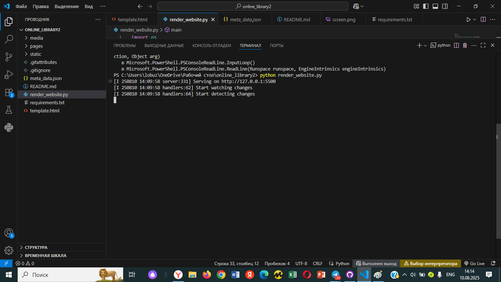
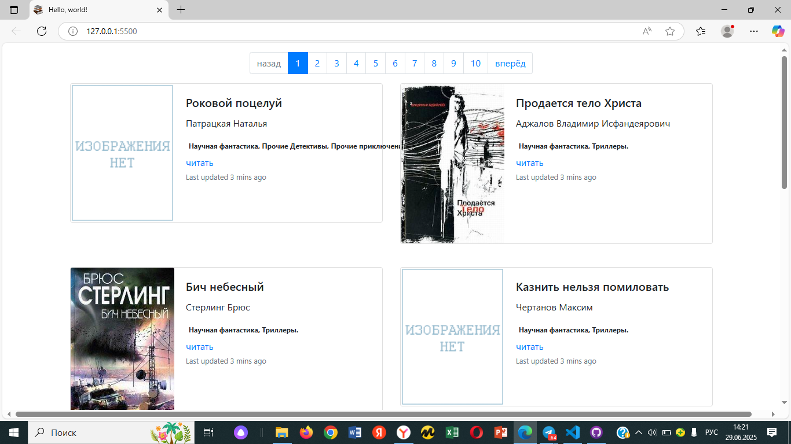

# Онлайн библиотека
## Описание
Этот проект создан для прочтения книг, которые собранны в одном месте 
## Установка
Скачайте необходимые файлы, затем используйте рір (или ріp3, если есть конфликт с Python2) для установки зависимостей и установить зависимости. Зависимости можно установить командой, представленной ниже. Установите зависимости командой:
```
pip install -r requirements.txt
```
## Пример запуска скрипта
Для запуска скрипта у вас уже должен быть установлен Python3. Для получения ссылки на проект:
```
python render_website.py
```
вы увидите сообщение из консоли 



## ссылка на публичную онлайн версию

https://kirilllob.github.io/online_library2/pages/index1.html
## ссылка на локальную версию
http://127.0.0.1:5500
## оффлайн версия сайта
Чтобы запустить оффлайн версия сайта вам нужно открыть папку с программой(online_library2),перейти в папку pages и открыть файл index1.html
## Цель проекта
Код написан в образовательных целях на онлайн-курсе для веб-разработчиков dvmn.org.